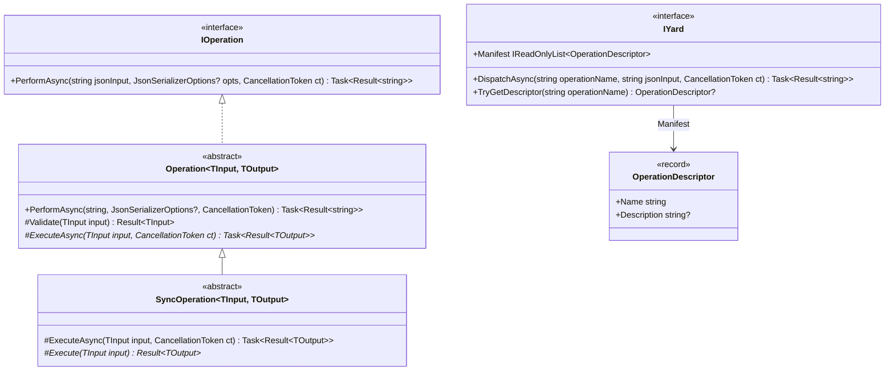
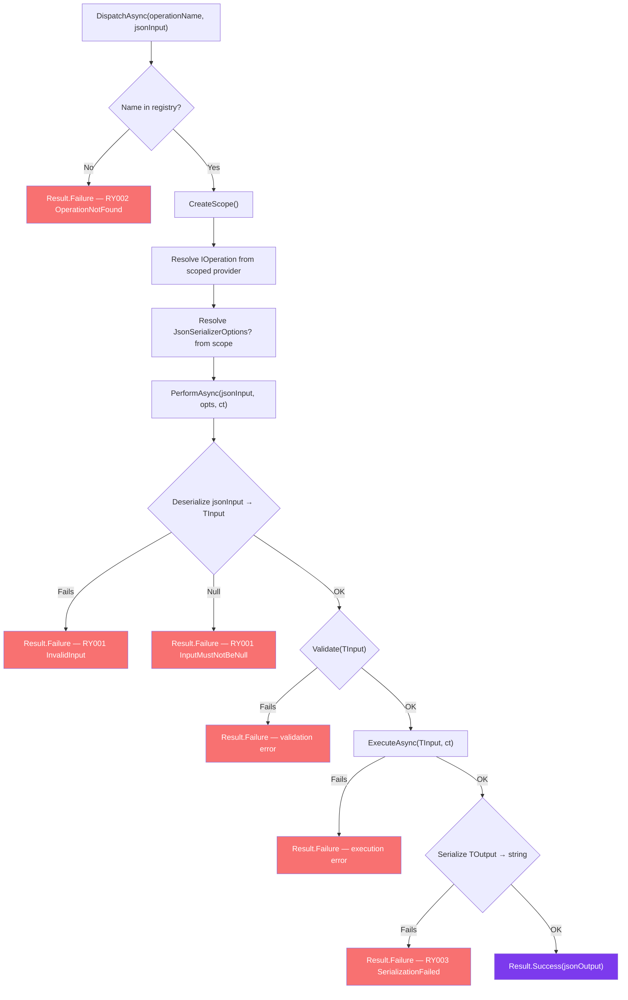
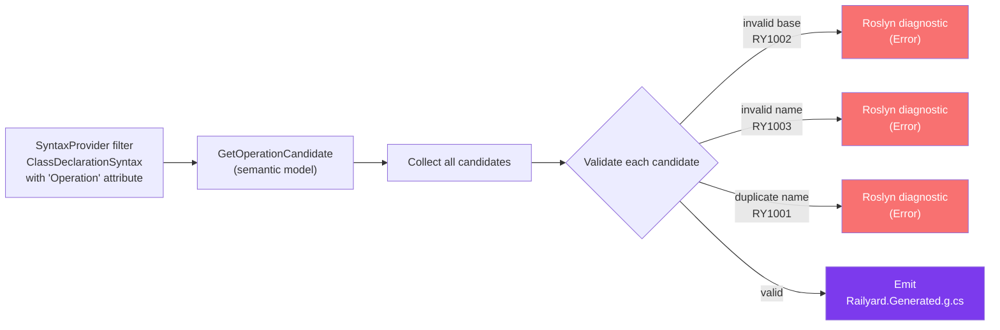
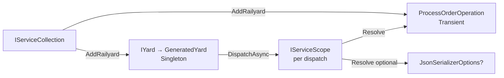

# Railyard Design

## Overview

Railyard provides a compile-time generated operation dispatcher. The boundary between the caller and each operation is **string-serialized JSON** — the caller never holds a typed reference to an operation directly. All wiring is emitted by the source generator at compile time; no reflection or runtime scanning is involved.

The library has two layers:

1. **Runtime** (`MaVe.Railyard`, `net8.0;net9.0`) — base classes, interfaces, error model
2. **Generator** (`MaVe.RailyardGenerator`, `netstandard2.0`) — discovers operations, emits `AddRailyard()` and `GeneratedYard`

## Class Hierarchy



### Key Constraints

- `TInput` and `TOutput` must be reference types (`where TInput : class where TOutput : class`). This ensures `System.Text.Json` can deserialize to a non-nullable instance.
- `Validate` is `virtual` with a pass-through default — override to add pre-execution validation without touching `ExecuteAsync`.
- `SyncOperation` seals `ExecuteAsync` and wraps `Execute` in `Task.FromResult`, so synchronous operations have no async overhead.

## Dispatch Pipeline

Every call to `IYard.DispatchAsync` follows this pipeline:



### Scope Isolation

Each dispatch creates and disposes its own `IServiceScope`. This means:

- Operations and their dependencies do **not** share the caller's ambient scope.
- `JsonSerializerOptions` is resolved from the operation's own scope, not the caller's.
- Multiple concurrent dispatches are fully isolated from each other.

### Error Contextualization

On failure, the generated yard prefixes the operation name onto the error message:

```
Operation 'process-order': Input could not be deserialized. ...
```

This makes errors unambiguous in logs when multiple operations share the same error codes.

## Source Generator Pipeline



### Discovery

The generator uses `CreateSyntaxProvider` for a two-phase incremental check:

1. **Syntax filter** — cheap: accepts any `ClassDeclarationSyntax` with an attribute list containing "Operation". No semantic model required.
2. **Semantic transform** — expensive: resolves the class symbol, confirms the attribute is exactly `MaVe.Railyard.OperationAttribute`, and extracts the dispatch name and optional description.

### Validation

| Check | Diagnostic | Severity |
|-------|-----------|---------|
| Class does not inherit `Operation<,>` or `SyncOperation<,>` | `RY1002` | Error |
| Dispatch name fails pattern `^[A-Za-z][A-Za-z0-9_-]*$` | `RY1003` | Error |
| Same dispatch name on two or more classes | `RY1001` | Error |

Classes that fail any check are excluded from generation. The remaining valid, unique candidates are sorted alphabetically by name before emission.

### Generated Output

For a project containing:

```csharp
[Operation("process-order", Description = "Processes a submitted order")]
public class ProcessOrderOperation : Operation<OrderRequest, OrderResult> { ... }
```

The generator emits `Railyard.Generated.g.cs`:

```csharp
// <auto-generated />
#nullable enable
namespace MaVe.Railyard;

public static class RailyardServiceCollectionExtensions
{
    public static IServiceCollection AddRailyard(this IServiceCollection services)
    {
        // One TryAdd per discovered operation (Transient)
        ServiceCollectionDescriptorExtensions.TryAdd(services,
            ServiceDescriptor.Transient(typeof(ProcessOrderOperation), typeof(ProcessOrderOperation)));

        // IYard registered as Singleton backed by GeneratedYard
        ServiceCollectionDescriptorExtensions.TryAdd(services,
            ServiceDescriptor.Singleton(typeof(IYard),
                sp => new GeneratedYard((IServiceScopeFactory)sp.GetService(typeof(IServiceScopeFactory))!)));

        return services;
    }
}

internal sealed class GeneratedYard : IYard
{
    // Dictionary<string, Func<IServiceProvider, IOperation>>
    // Dictionary<string, OperationDescriptor>
    // IReadOnlyList<OperationDescriptor> Manifest
    // DispatchAsync — creates scope, resolves operation, calls PerformAsync
}
```

Key properties of the generated code:

| Property | Detail |
|----------|--------|
| Operation registration | `TryAdd` — consuming projects can override with their own registration |
| Lifetime | Operations: `Transient`; `IYard`: `Singleton` |
| Name lookup | `Dictionary<string, ...>` with `StringComparer.Ordinal` — no case folding |
| Scope creation | `IServiceScopeFactory` injected into `GeneratedYard` constructor |

## DI Integration



`IYard` is safe to inject into singleton services because `GeneratedYard` holds only `IServiceScopeFactory`, which is itself singleton-safe. Operations are resolved fresh from a new scope on each dispatch.

## Error Model

Railyard uses two distinct error namespaces — runtime errors carried in `Result<string>` and compile-time Roslyn diagnostics:

### Runtime Errors (`RailyardErrors`)

| Code | Factory method | Trigger |
|------|---------------|---------|
| `RY001` | `InvalidInput(string? detail)` | JSON deserialization of input fails |
| `RY001` | `InputMustNotBeNull()` | Deserialized input is null |
| `RY002` | `OperationNotFound(string name)` | No operation registered with the given name |
| `RY003` | `SerializationFailed(string? detail)` | JSON serialization of output fails |

### Compile-Time Diagnostics

| ID | Message | Trigger |
|----|---------|---------|
| `RY1001` | Duplicate operation name `'{0}'` | Two or more classes declare the same dispatch name |
| `RY1002` | Operation `'{0}'` must inherit from `Operation<TInput, TOutput>` or `SyncOperation<TInput, TOutput>` | `[Operation]` on a class with wrong base |
| `RY1003` | Operation name `'{0}'` is invalid | Name fails `^[A-Za-z][A-Za-z0-9_-]*$` |

All three compile-time diagnostics are `Error` severity — they block generation and must be resolved before the project builds cleanly.

## Design Trade-offs

| Decision | Trade-off |
|----------|-----------|
| JSON string boundary on `IYard` | Enables dispatching from any serialization context (HTTP, message queues, CLI) without type coupling; costs a serialize/deserialize round-trip per call |
| Scope-per-dispatch | Full isolation between concurrent calls; prevents accidental scope bleed from the caller, but does not reuse resources within a single caller request |
| `TryAdd` for operation registration | Consuming projects can swap out a generated registration; also means calling `AddRailyard()` twice is safe |
| All diagnostics are `Error` not `Warning` | Invalid configurations are never silently skipped — the generator either emits correct code or emits nothing and reports an error |
| Operations sorted alphabetically in generated file | Deterministic output; diffs are stable regardless of declaration order in source |
