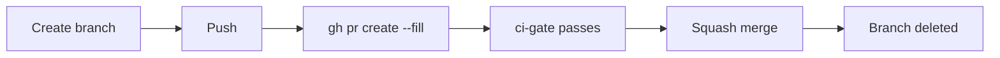
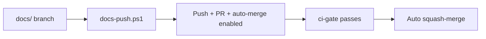

# Branching and Pull Requests

## Branch Prefixes

| Prefix | Purpose | Example |
|--------|---------|---------|
| `docs/` | Documentation, proposals, ADRs | `docs/ways-of-working` |
| `feat/` | New features | `feat/add-option-map` |
| `fix/` | Bug fixes | `fix/result-null-handling` |
| `refactor/` | Restructuring without behavior change | `refactor/simplify-bind-chain` |
| `chore/` | CI, tooling, dependencies | `chore/update-ci-dotnet-version` |

Enforcement: the `pre-push` git hook rejects pushes from branches that don't
match. See [Developer Setup](./developer-setup.md) for details.

## Commit Messages

[Conventional Commits](https://www.conventionalcommits.org/) format:

```
<type>(optional-scope): <short description>
```

Types mirror branch prefixes: `docs`, `feat`, `fix`, `refactor`, `chore`, `test`.

**Examples:**

```
feat(monads): add Option.Map overload for async projections
fix(businessrules): handle null rule context in generator
docs: add proposal for railway-oriented API
chore(ci): add docs-only guard to ci-gate
test(monads): add Result.Bind edge case coverage
```

## PR Lifecycle (Code Changes)



1. Start from updated `main`: `git checkout main && git pull`
2. Create branch: `git checkout -b feat/my-feature`
3. Commit and push
4. Create PR: `gh pr create --fill`
5. Wait for `ci-gate` — the single required status check
6. Squash merge via GitHub UI or `gh pr merge --squash --delete-branch`

## Docs Fast-Track Workflow

Documentation-only PRs have a lighter, automated path:



The `tools/docs-push.ps1` script:

1. Verifies you are on a `docs/` branch
2. Verifies the working tree is clean
3. Pushes to origin
4. Creates a PR with `gh pr create --fill`
5. Enables auto-merge: `gh pr merge --squash --auto --delete-branch`

### docs-only-guard

The CI pipeline includes a `docs-only-guard` job that fires on PRs from `docs/`
branches. It scans all changed files and **fails** if any non-documentation file
is modified.

Documentation files are: `docs/**`, `README.md`, `CONTRIBUTING.md`, `LICENSE`,
`CHANGELOG.md`.

This prevents accidental code changes from being auto-merged on the fast-track
path.
