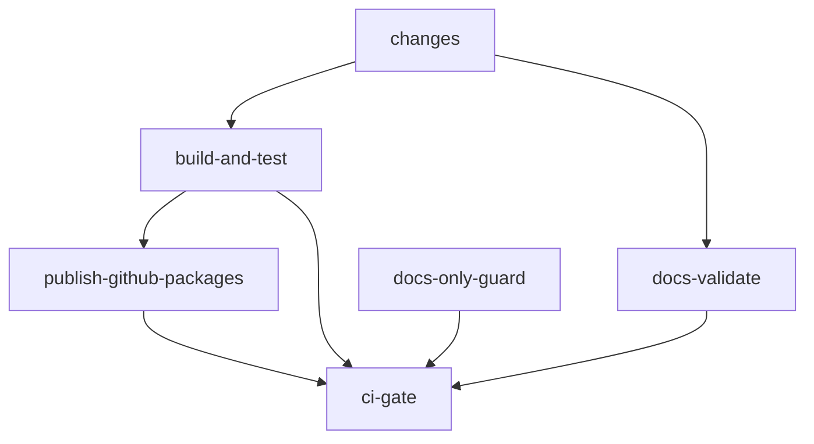

# CI Pipeline Reference

The CI pipeline runs on every pull request and every push to `main`.

## Job Dependency Graph



`ci-gate` is the **single required status check** configured in the GitHub
branch ruleset. All conditional jobs funnel into it.

## Jobs

| Job | Runs when | Purpose |
|-----|-----------|---------|
| `changes` | Always | Detects which paths changed; sets `code` and `docs` outputs |
| `build-and-test` | `code` changed, or push to `main` | Build (Release), test with coverage, pack `.nupkg` artifacts |
| `docs-validate` | `docs` or `code` changed, or push to `main` | Validates the Docusaurus site builds cleanly |
| `publish-github-packages` | Push to `main` after successful `build-and-test` | Publishes prerelease packages to GitHub Packages |
| `docs-only-guard` | PRs from `docs/` branches | Rejects non-documentation files on docs branches |
| `ci-gate` | Always | Aggregates results; fails if any upstream job failed |

## Path Filtering

The `changes` job uses `dorny/paths-filter` to classify what changed:

**`code` filter** — triggers `build-and-test`:
```
src/**
tests/**
*.sln, *.slnf
Directory.Build.props
Directory.Packages.props
tools/**
.github/workflows/**
```

**`docs` filter** — triggers `docs-validate`:
```
docs/**
```

Push events to `main` always run `build-and-test` and `docs-validate`
regardless of path filters — this ensures `main` is always known-good.

## Why One Required Status Check

`ci-gate` is the only check required by branch protection rules, rather than
requiring each individual job. This pattern solves a GitHub limitation: optional
(skipped) jobs appear as neither passing nor failing, making them unusable as
required checks.

`ci-gate` always runs and explicitly inspects the result of each upstream job.
A skipped job is treated as passing; a failed job causes `ci-gate` to fail.

## Reusable Workflows

The heavy lifting is split into reusable workflows called from `ci.yml`:

| Workflow | Callers |
|----------|---------|
| `_build-and-test.yml` | `ci.yml` (build-and-test job), `release.yml` |
| `_docs-validate.yml` | `ci.yml` (docs-validate job) |
| `_publish-packages.yml` | `ci.yml` (publish-github-packages job), `release.yml` (publish-nuget job) |

This avoids duplication between the CI and release workflows — both use the
same tested build and publish steps.

## CI is Red — Now What?

| Symptom | Likely cause |
|---------|-------------|
| `build-and-test` fails | Compilation error or test failure — check the step output |
| `docs-validate` fails | Docusaurus build error — run `npm run build` in `docs/` locally |
| `docs-only-guard` fails | Non-documentation file changed on a `docs/` branch |
| `ci-gate` fails but all jobs are green | A job result was `cancelled` — re-run the workflow |
