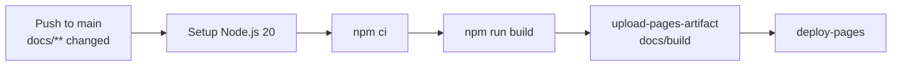

# Docs Deployment

## When Docs Deploy

The documentation site deploys automatically when a push to `main` touches any
file under `docs/**`. Other pushes to `main` (code-only) do not trigger a
deployment.

This is controlled by the `on.push.paths` filter in `deploy-docs.yml`:

```yaml
on:
  push:
    branches: [main]
    paths: ['docs/**']
```

## Deployment Pipeline



The `npm run build` step runs Docusaurus's production build. The output lands
in `docs/build/` and is uploaded as a GitHub Pages artifact, then deployed via
the `actions/deploy-pages` action.

## GitHub Pages Permissions

The deploy job requires two elevated permissions that are absent from the
default `GITHUB_TOKEN` scope:

| Permission | Why |
|------------|-----|
| `pages: write` | Upload and deploy the Pages artifact |
| `id-token: write` | OIDC token required by `actions/deploy-pages` for trusted deployment |

These are set on the job, not the workflow, to keep the blast radius minimal.

## Deployment Environment

The job targets the `github-pages` environment. GitHub Pages environments gate
deployments and expose the live URL as a job output:

```yaml
environment:
  name: github-pages
  url: ${{ steps.deployment.outputs.page_url }}
```

The live site URL appears in the workflow run summary after a successful
deployment.

## Testing Locally Before Pushing

Always verify the docs build locally before pushing to `main`:

```powershell
cd docs
npm ci        # first time or after package-lock.json changes
npm run build
```

A successful build outputs to `docs/build/`. Fix any broken links or MDX
errors before pushing — `onBrokenLinks` is set to `throw` in
`docusaurus.config.ts`, so broken internal links are build errors, not warnings.

## Validation vs Deployment

Two workflows cover the docs site:

| Workflow | When | Purpose |
|----------|------|---------|
| `_docs-validate.yml` | Every PR + every push to `main` | Validates the site builds — part of `ci-gate` |
| `deploy-docs.yml` | Push to `main` with `docs/**` changes | Builds and deploys to GitHub Pages |

Validation runs on every PR so docs regressions are caught before merge.
Deployment only runs post-merge, on pushes to `main`.
