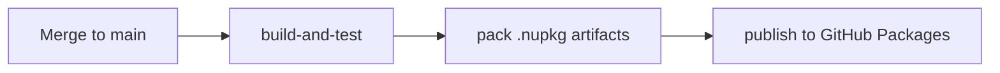
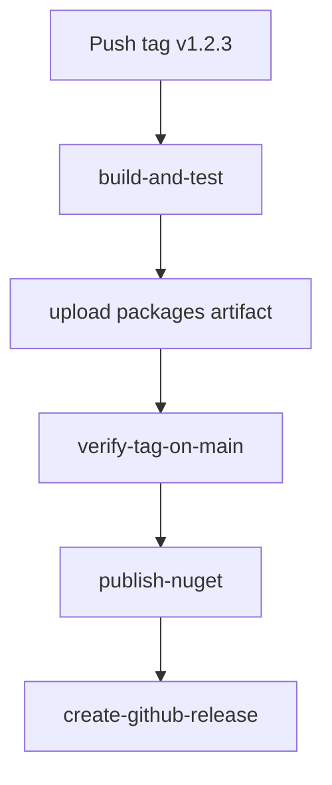

# Versioning and Releases

## Nerdbank.GitVersioning

Package versions are computed by [Nerdbank.GitVersioning](https://github.com/dotnet/Nerdbank.GitVersioning)
(NBGV) from two inputs: a `version.json` file and the git commit height.

```
version = <major>.<minor>.<commit-height>[-prerelease-suffix]
```

The commit height is the number of commits reachable from the current commit
that are also within the scope of the `version.json`'s `pathFilters`. This
means independent packages version independently.

## `version.json` Files

Each independently-versioned package has its own `version.json`:

| File | Scope |
|------|-------|
| `version.json` (root) | Repo-wide defaults (`publicReleaseRefSpec`, cloud build config) |
| `src/Monads/version.json` | Monads package |
| `src/BusinessRules/version.json` | BusinessRules + analyzers (shared version) |
| `src/BusinessRules.ResultExtensions/version.json` | BusinessRules.ResultExtensions |
| `src/BusinessRules.Wcf/version.json` | BusinessRules.Wcf |
| `src/Unions/version.json` | Unions |

### `pathFilters`

Each per-package `version.json` sets `pathFilters` scoped to the relevant
source directories. NBGV only counts commits that touch those paths when
computing the version height.

Example — `BusinessRules/version.json` includes the Roslyn components because
a change to the analyzer or generator should bump the BusinessRules package
version:

```json
{
  "version": "0.1",
  "pathFilters": [
    ".",
    "../BusinessRulesAnalyzer",
    "../BusinessRulesGenerator",
    "../BusinessRulesFixProvider"
  ]
}
```

A commit touching only `src/Monads/` does not bump the BusinessRules
version, and vice versa.

## Prerelease Flow

Every merge to `main` that touches code automatically publishes prerelease
packages to GitHub Packages:



These are alpha packages — consumers can reference them for early testing.
Version example: `0.1.42-alpha.0.3+abc1234`.

## Stable Release Flow

Stable releases publish to NuGet.org and are triggered by pushing a version tag:



**`verify-tag-on-main`** performs two checks before publishing:
1. The tagged commit is on the `main` lineage
2. The tag version (`v1.2.3` → `1.2.3`) matches the version in **every** built
   `.nupkg` filename in the artifact

This guarantees the published packages are exactly the artifacts that passed CI
— no recompilation, no version drift.

## Release Operator Checklist

1. Bump `version.json` for each package being released (change `"version"`)
2. Merge to `main`
3. Verify the merge commit produces the expected version:
   ```powershell
   dotnet tool run nbgv get-version
   ```
4. Tag the merge commit: `git tag v1.2.3`
5. Push the tag: `git push origin v1.2.3`
6. Watch `release.yml` — it must pass `verify-tag-on-main` before publishing

If `verify-tag-on-main` fails because of a version mismatch, delete the tag,
fix `version.json`, merge again, and re-tag.
